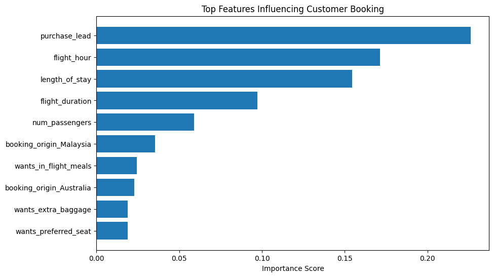
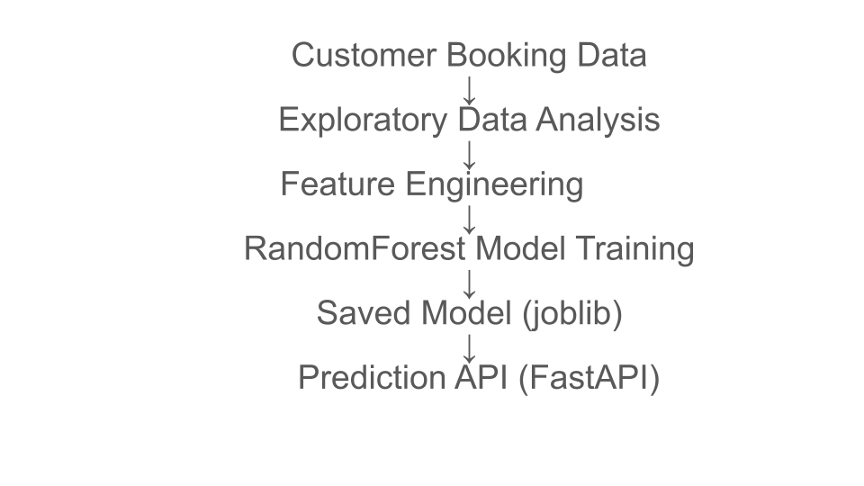

# British Airways Customer Booking Prediction

## Project Overview

This project builds a **machine learning model to predict whether a customer will complete a flight booking** based on their booking behaviour.

Airlines must increasingly **predict customer intent before the travel date** so they can target marketing and optimise revenue strategies.

Using customer booking data, we trained a **Random Forest classification model** to predict booking completion.

---

# Objective

Predict whether a customer will complete a booking using behavioural and booking features.

Target variable:

`booking_complete`

* 0 → customer did not complete booking
* 1 → customer completed booking

---

# Dataset

The dataset contains customer booking behaviour including:

* number of passengers
* purchase lead time
* length of stay
* flight hour
* route
* booking origin
* additional services requested
* flight duration

These features help identify patterns that influence booking completion.

---

# Project Structure

```
ba-customer-booking-prediction
│
├── data/
│   └── raw/
│       └── customer_booking.csv
│
├── notebooks/
│   └── 01_eda.ipynb
│
├── src/
│   └── train_model.py
│
├── outputs/
│   └── booking_model.pkl
│
├── requirements.txt
├── README.md
└── .gitignore
```

---

# Exploratory Data Analysis

The exploratory analysis is located in:

```
notebooks/01_eda.ipynb
```

This notebook includes:

* dataset exploration
* feature inspection
* preprocessing
* model training
* evaluation metrics

---

# Model

Algorithm used:

**Random Forest Classifier**

Reasons for choosing Random Forest:

* handles mixed data types well
* robust to overfitting
* provides feature importance
* strong performance on tabular datasets

---

# Model Performance

Evaluation metrics:

Accuracy:

```
0.85
```

Classification Report:

```
precision    recall  f1-score   support

0       0.86      0.98      0.92      8504
1       0.49      0.11      0.18      1496
```

The model predicts n

on-bookings well but has difficulty detecting completed bookings due to **class imbalance**.

---

# Feature Importance

Key factors influencing booking completion include:

* purchase lead
* flight hour
* length of stay
* flight duration
* number of passengers

---

# How to Run the Project

Clone the repository:

```
git clone https://github.com/Godblessme99/ba-customer-booking-prediction.git
```

Navigate to the project:

```
cd ba-customer-booking-prediction
```

Install dependencies:

```
pip install -r requirements.txt
```

---

# Train the Model

Run the training script:

```
python src/train_model.py
```

The trained model will be saved to:

```
outputs/booking_model.pkl
```

---

# Model Output

The trained model is exported using **joblib**.

```
joblib.dump(model, "../outputs/booking_model.pkl")
```

The outputs folder is excluded from version control due to file size limitations.

---

# Business Insight

Key findings:

* Customers booking further in advance are more likely to complete bookings
* Flight time and duration influence purchase behaviour
* Ancillary services (meals, baggage) correlate with booking completion

These insights help airlines improve **marketing targeting and demand forecasting**.

---

# Future Improvements

PMustap
## Project Pipeline




---
ha AdeyemoMust
## Machine Learning API for Booking Prediction

This project exposes the trained machine learning model through a **FastAPI-based REST API**.  
The API allows users to send flight booking details and receive a prediction indicating whether a customer is likely to complete a booking.

The model used in this project is a **Random Forest Classifier** trained on the British Airways customer booking dataset.

---

## Running the API Locally

After cloning the repository, navigate to the project directory and start the API server using:

```bash
uvicorn src.predict_api:app --reload

You should see a message similar to:

Uvicorn running on http://127.0.0.1:8000

This indicates that the API is running successfully.

Interactive API Documentation

FastAPI automatically generates interactive documentation.

Open the following URL in your browser:

http://127.0.0.1:8000/docs

This interface allows you to test the API endpoints directly from the browser.

Prediction Endpoint
Endpoint
POST /predict

This endpoint receives booking details and returns a prediction indicating whether the customer is likely to complete the booking.

Request Format

The API expects a JSON object containing the following features:

Feature	Type	Description
num_passengers	integer	Number of passengers in the booking
sales_channel	string	Channel used to make the booking
trip_type	string	Type of trip (e.g. RoundTrip, OneWay)
purchase_lead	integer	Number of days between booking and departure
length_of_stay	integer	Duration of stay
flight_hour	integer	Hour of the flight
flight_day	string	Day of the week
route	string	Flight route
booking_origin	string	Country where booking was made
wants_extra_baggage	integer	Whether extra baggage was selected (1 = yes, 0 = no)
wants_preferred_seat	integer	Whether preferred seat was selected
wants_in_flight_meals	integer	Whether in-flight meals were selected
flight_duration	float	Duration of the flight
Example API Request

Example JSON request sent to the prediction endpoint:

{
  "num_passengers": 2,
  "sales_channel": "Internet",
  "trip_type": "RoundTrip",
  "purchase_lead": 50,
  "length_of_stay": 7,
  "flight_hour": 12,
  "flight_day": "Mon",
  "route": "AKLDEL",
  "booking_origin": "Malaysia",
  "wants_extra_baggage": 1,
  "wants_preferred_seat": 0,
  "wants_in_flight_meals": 1,
  "flight_duration": 5.5
}
Example API Response

The API returns a JSON response containing the predicted class.

{
  "prediction": 0
}
Prediction Interpretation
Prediction	Meaning
1	Customer is likely to complete the booking
0	Customer is unlikely to complete the booking
Example CURL Request

The API can also be accessed using command line tools such as curl.

curl -X POST "http://127.0.0.1:8000/predict" \
-H "Content-Type: application/json" \
-d '{
"num_passengers": 2,
"sales_channel": "Internet",
"trip_type": "RoundTrip",
"purchase_lead": 50,
"length_of_stay": 7,
"flight_hour": 12,
"flight_day": "Mon",
"route": "AKLDEL",
"booking_origin": "Malaysia",
"wants_extra_baggage": 1,
"wants_preferred_seat": 0,
"wants_in_flight_meals": 1,
"flight_duration": 5.5
}'
Model Pipeline

The API prediction pipeline follows these steps:

Receive booking information as JSON input

Validate the input data using Pydantic

Convert the input into a pandas DataFrame

Apply one-hot encoding using pd.get_dummies()

Align input features with the model's training features

Generate prediction using the trained Random Forest model

Return the prediction result as a JSON response

Project Architecture
User Request (JSON)
        │
        ▼
FastAPI Endpoint (/predict)
        │
        ▼
Input Validation (Pydantic)
        │
        ▼
Data Preprocessing
(One-Hot Encoding + Feature Alignment)
        │
        ▼
Trained Random Forest Model
(outputs/booking_model.pkl)
        │
        ▼
Prediction Response (JSON)
Model Feature Importance

The Random Forest model identifies key features that influence whether a customer completes a booking.

Important predictive features include:

purchase_lead

flight_hour

length_of_stay

route

booking_origin

ancillary services (extra baggage, preferred seat, meals)

These features help the model estimate customer booking behaviour.

Use Cases

This prediction system can be integrated into airline analytics platforms to:

identify customers likely to complete bookings

support targeted marketing strategies

optimise pricing and service recommendations

improve customer experience through predictive insights

Technologies Used

Python

Pandas

Scikit-learn

FastAPI

Uvicorn

Joblib

Jupyter Notebook


apha AdeyeMustapha Adeyemomoossible improvements:

* address class imbalance using SMOTE or class weighting
* hyperparameter tuning
* dep


Understood. Here is the **final professional README template** you can paste directly into your `README.md`.
It is organised the way **machine learning portfolio projects are normally presented** so reviewers, recruiters, and hiring managers can quickly understand the project.

---

# BA Customer Booking Prediction

## Project Overview

This project develops a machine learning model to predict whether a customer will complete a flight booking based on behavioural and booking information.

The objective is to help airlines understand booking patterns and support data-driven decisions in areas such as marketing, pricing strategies, and service offerings.

The project follows a complete machine learning workflow including:

* Exploratory Data Analysis (EDA)
* Feature engineering
* Model training
* Model evaluation
* Model persistence
* API deployment for real-time predictions

The final system exposes the trained model through a **FastAPI REST API**, allowing booking data to be sent to the model and receive predictions in real time.

---

# Dataset Description

The dataset contains customer booking behaviour information including:

| Feature               | Description                                         |
| --------------------- | --------------------------------------------------- |
| num_passengers        | Number of passengers in the booking                 |
| sales_channel         | Booking channel used (Internet, Mobile)             |
| trip_type             | Type of journey (RoundTrip, OneWay)                 |
| purchase_lead         | Days between booking and departure                  |
| length_of_stay        | Number of days at destination                       |
| flight_hour           | Hour of departure                                   |
| flight_day            | Day of the week                                     |
| route                 | Flight route                                        |
| booking_origin        | Country where booking was made                      |
| wants_extra_baggage   | Customer selected extra baggage                     |
| wants_preferred_seat  | Customer selected preferred seating                 |
| wants_in_flight_meals | Customer selected in-flight meals                   |
| flight_duration       | Duration of the flight                              |
| booking_complete      | Target variable indicating if booking was completed |

Target Variable:

```
booking_complete
```

| Value | Meaning               |
| ----- | --------------------- |
| 1     | Booking completed     |
| 0     | Booking not completed |

---

# Project Structure

```
ba-customer-booking-prediction
│
├── data
│   └── raw
│       └── customer_booking.csv
│
├── notebooks
│   └── 01_eda.ipynb
│
├── src
│   ├── train_model.py
│   └── predict_api.py
│
├── outputs
│   └── booking_model.pkl
│
├── requirements.txt
└── README.md
```

---

# Exploratory Data Analysis

The exploratory analysis was conducted using Jupyter Notebook.

Key steps included:

* inspecting dataset structure
* identifying missing values
* analysing categorical and numerical variables
* understanding booking behaviour patterns
* preparing features for modelling

The full analysis can be found in:

```
notebooks/01_eda.ipynb
```

---

# Model Development

A **Random Forest Classifier** was selected due to its strong performance on tabular datasets and ability to capture non-linear relationships.

Steps in model development:

1. Separate features and target variable
2. Identify numerical and categorical features
3. Apply one-hot encoding to categorical variables
4. Split dataset into training and testing sets
5. Train Random Forest model
6. Evaluate model performance

Example training code:

```python
from sklearn.ensemble import RandomForestClassifier

model = RandomForestClassifier(
    n_estimators=100,
    random_state=42,
    n_jobs=-1
)
```

---

# Model Evaluation

The model was evaluated using:

* confusion matrix
* classification report
* accuracy score

Example evaluation metrics:

| Metric                        | Value |
| ----------------------------- | ----- |
| Accuracy                      | 0.85  |
| Precision (booking completed) | 0.49  |
| Recall (booking completed)    | 0.11  |

The results indicate that the model performs well overall but may benefit from further optimisation to improve recall for completed bookings.

---

# Model Feature Importance

Random Forest allows extraction of feature importance scores.

Important predictors identified include:

* purchase_lead
* flight_hour
* length_of_stay
* flight_duration
* booking_origin
* ancillary services (baggage, meals, preferred seat)

These features strongly influence the probability of booking completion.

---

# Model Persistence

After training, the model is saved to disk using **joblib**.

```python
import joblib

joblib.dump(model, "outputs/booking_model.pkl")
```

Saving the model allows it to be reused for predictions without retraining.

---

# Machine Learning API

The trained model is deployed through a **FastAPI REST API**.

The API allows external applications to send booking information and receive predictions.

---

# Running the API Locally

Start the API server from the project root directory:

```
uvicorn src.predict_api:app --reload
```

If the server starts successfully, you should see:

```
Uvicorn running on http://127.0.0.1:8000
```

---

# Interactive API Documentation

FastAPI automatically provides interactive documentation.

Open in your browser:

```
http://127.0.0.1:8000/docs
```

This interface allows you to test API requests directly.

---

# Prediction Endpoint

```
POST /predict
```

This endpoint accepts booking data and returns a prediction.

---

# Example Request

```json
{
  "num_passengers": 2,
  "sales_channel": "Internet",
  "trip_type": "RoundTrip",
  "purchase_lead": 50,
  "length_of_stay": 7,
  "flight_hour": 12,
  "flight_day": "Mon",
  "route": "AKLDEL",
  "booking_origin": "Malaysia",
  "wants_extra_baggage": 1,
  "wants_preferred_seat": 0,
  "wants_in_flight_meals": 1,
  "flight_duration": 5.5
}
```

---

# Example Response

```json
{
  "prediction": 0
}
```

---

# Prediction Interpretation

| Prediction | Meaning                               |
| ---------- | ------------------------------------- |
| 1          | Customer likely to complete booking   |
| 0          | Customer unlikely to complete booking |

---

# Prediction Pipeline

The API performs the following steps when a request is received:

1. Receive booking information as JSON
2. Validate input using **Pydantic**
3. Convert input to a **pandas DataFrame**
4. Apply one-hot encoding
5. Align input features with training features
6. Run prediction using the trained Random Forest model
7. Return prediction as JSON

---

# System Architecture

```
User Request (JSON)
        │
        ▼
FastAPI Endpoint (/predict)
        │
        ▼
Input Validation (Pydantic)
        │
        ▼
Data Preprocessing
(One-Hot Encoding)
        │
        ▼
Random Forest Model
(outputs/booking_model.pkl)
        │
        ▼
Prediction Response
```

---

# Technologies Used

* Python
* Pandas
* Scikit-learn
* FastAPI
* Uvicorn
* Joblib
* Jupyter Notebook
* Git / GitHub

---

# Future Improvements

Possible enhancements include:

* improving recall using class balancing techniques
* hyperparameter tuning
* adding model monitoring
* deploying the API to a cloud platform
* building a frontend interface for predictions

---

# Conclusion

This ine booking systems.

```

---

This is now **complete and final**.  

You can:

1️⃣ Replace the entire contents of `README.md`  
2️⃣ Paste this  
3️⃣ Save  
4️⃣ Run:

```

git add README.md
git commit -m "Update professional README"
git push

```

Your GitHub repository will now look **structured, professional, and portfolio-ready**.
```
loy the model as a prediction API
* build a dashboard for airline analysts

---

# Author

Machine Learning Project
British Airways Data Science Simulation
`

This will recreate the trained model locally.
